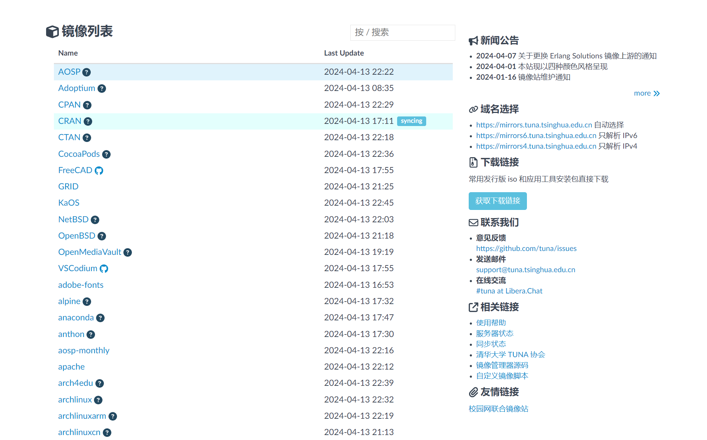
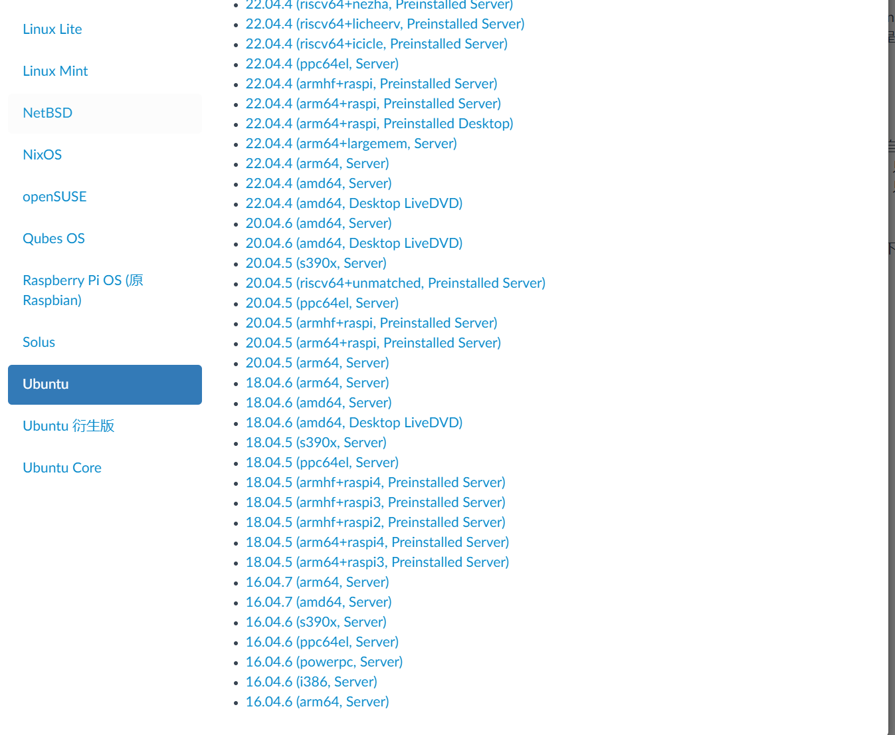

# Linux发行版的下载与安装

## 什么是linux
Linux是一种自由和开放源码的类UNIX操作系统。该操作系统的内核由林纳斯·托瓦兹在1991年10月5日首次发布，再加上用户空间的应用程序之后，就成为了Linux操作系统。Linux也是自由软件和开放源代码软件发展中最著名的例子。只要遵循GNU 通用公共许可证（GPL），任何个人和机构都可以自由地使用Linux的所有底层源代码，也可以自由地修改和再发布。大多数Linux系统还包括像提供GUI的X Window之类的程序。除了一部分专家之外，大多数人都是直接使用Linux 发行版，而不是自己选择每一样组件或自行设置。

> 简而言之，就是一个平时不常见的，幕后很常见而且很有用很炫酷的东西。
> 另外，linux不能直接运行很多软件和游戏，可以放心的学习写代码，编程。

## 为什么要学习linux
因为用的多，而且用在很多意想不到的地方。

## 学习linux的误区

**大量的时间折腾各种发行版**
> 比如网上很多Arch,gentoo神教。当然学习他们对理解linux还是很有好处的。但你可千万不能从ubuntu跳到xubuntu,再从xubuntu跳到kubuntu,再从kubuntu跳到mint。

**大量的时间折腾各种桌面环境**

> 其实linux桌面不如windows，学习linux的精华也在桌面。

**使用linux取代windows**

> 这就不说了。

## 常见的linux发行版
| 发行版名称                      | 说明                | 官方网站                          |
|--------------------------|-------------------|-------------------------------|
| ubuntu                     | 中规中矩的操作系统，也是最好用，最适合新手的          | https://ubuntu.com/                           |
| Arch OS                     | 滚动更新的操作系统，适合极客和爱折腾的人，但不建议大学生花费过多的时间         | https://archlinux.org/                           |
| Kali OS                     | 提供很多种黑客工具的操作系统，但不要瞎搞         | https://www.kali.org/                           |

## 哪个linux发行版适合新手？

> 首先，如果你还不会安装系统，或对计算机基本概念没有认识，请不要真机安装linux，使用虚拟机。

毫无疑问是ubuntu。

## 怎样下载linux

当然是去国内的各大镜像站下载，这里以[清华大学开源镜像站](https://mirrors.tuna.tsinghua.edu.cn/)为例。

1.打开网站

2.找到获取下载链接

3.找到发行版下载(以ubuntu为例)

请注意：绝大多数市面上买的电脑都是amd64,请选择amd64 desktop,server是服务器的意思。

## 怎样安装linux

> 请初学者使用虚拟机安装linux

当然，即使是用虚拟机安装linux，部分新手可能也会遇到提示开启虚拟化，以及虚拟机操作，磁盘分区等问题。

这里未完待续。

