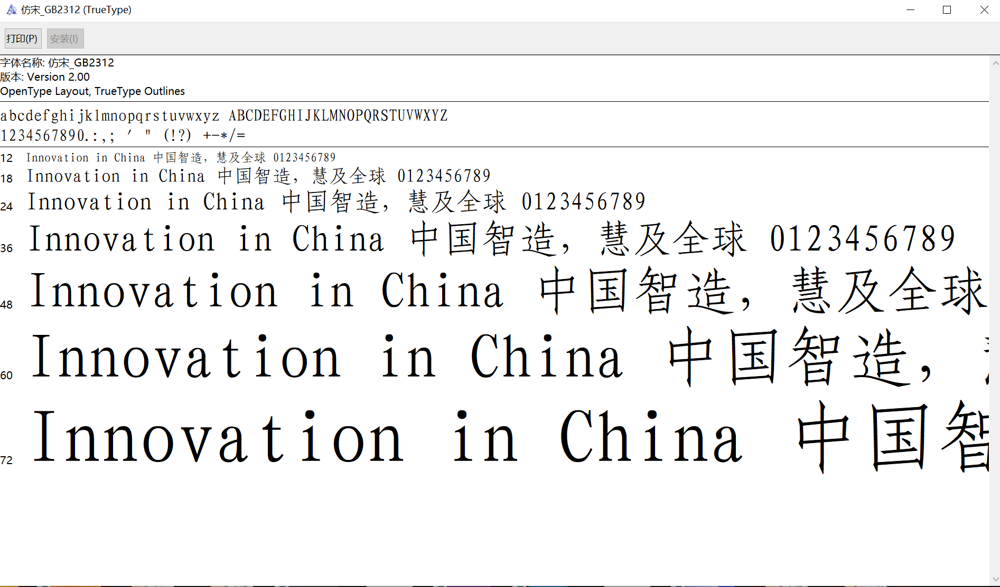

# 为什么要写这个

避免大学造成不必要的麻烦。

## 字体的下载

可以通过搜索引擎，找到想要的字体。字体的文件后缀名有ttf,eot等等，ttf居多。

## 大学和工作能用到的字体

| 应用场景    |   字体                          
|------------|--------|
|毕业论文|Times NewRoman,黑体，宋体（这些电脑里都有）|
|公文|方正小标宋简体，仿宋GB2312|

> 按照《国家行政机关公文格式》（GB/T9704-1999）规定：行政机关公文的发文机关标识（即俗称的红头）推荐使用小标宋体字，用红色标识；公文标题应使用2号小标宋体字；公文主题词的词目应使用3号小标宋体字。而普通电脑一般未自带该字体，需手动下载安装。

* [下载方正小标宋简体](./font/方正小标宋简.TTF)

* [下载仿宋GB2312](./font/仿宋_GB2312.ttf)

## 如何安装字体

直接点上面的安装就好了。

