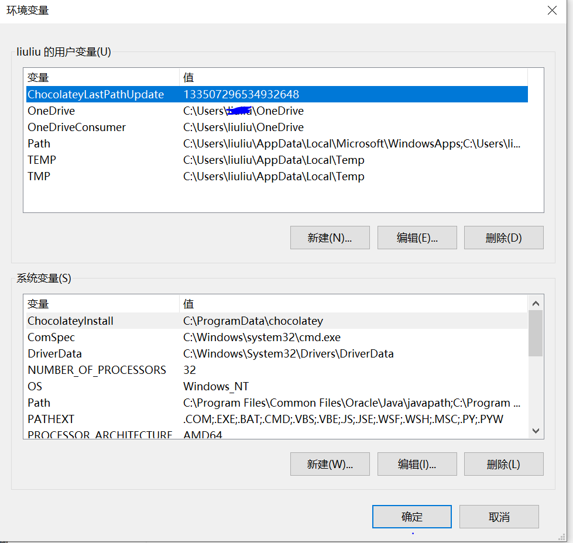

# 什么是环境变量

首先要明白一个概念，就是我们的OS（Operate System）中文译为操作系统，本质上就是一个巨大的软件。

环境变量符合”变量“和”环境的特征

环境：指操作系统，程序都可以用

变量：可以被赋值，被取值

## 如何设置环境变量

以windows10为例，linux操作系统请查看相关书籍。

在搜索框中搜索“环境变量”,找到编辑系统环境变量

接着看到下面的环境变量

然后就可以设置了

当然，具体的设置，请善用百度，本文不做具体介绍。
