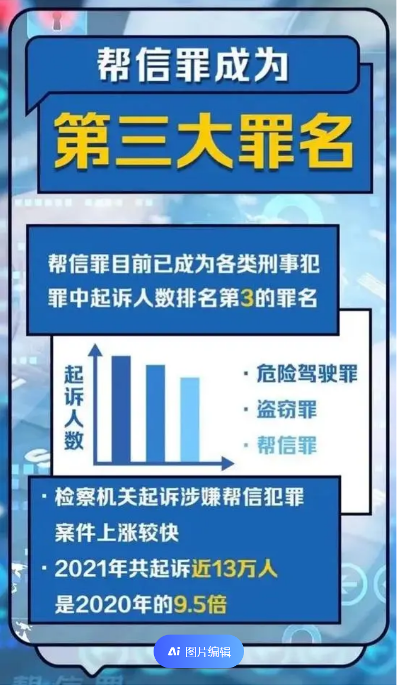
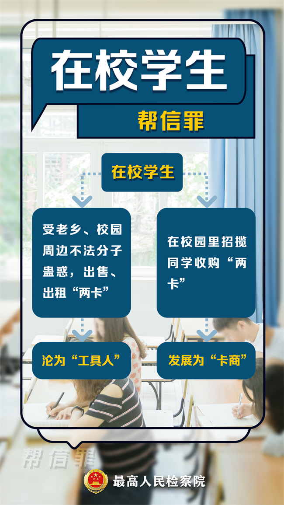

# 为什么要写这个

对于大部分读者来说，需不需要了解这块内容：**需要**

虽然犯罪这个词离大家实在是太遥远，但是这两类罪实在是大学生杀手，尤其如果你的学校**层级不高**，或者你在做一些**兼职**,你更需要尽力避免。

因为学校从来不是象牙塔，社会上也充满了险恶。

## 什么是帮助信息网络犯罪活动罪和掩饰隐瞒犯罪所得罪

帮助信息网络犯罪活动罪

> 本罪是指自然人或者单位明知他人利用信息网络实施犯罪，为其犯罪提供互联网接入、服务器托管、网络存储、通讯传输等技术支持，或者提供广告推广、支付结算等帮助，情节严重的行为。

掩饰隐瞒犯罪所得罪

> 明知是犯罪所得及其产生的收益而予以窝藏、转移、收购、代为销售或者以其他方法掩饰、隐瞒的，处三年以下有期徒刑、拘役或者管制，并处或者单处罚金；情节严重的，处三年以上七年以下有期徒刑，并处罚金。

## 什么情况下容易犯这两个罪？

如果你将银行卡，身份证，电话卡借予他人使用。
如果你正在从事刷单或其他的网络赚钱（包括虚拟货币）。
如果你作为个人开发者，接了和赌博，洗钱相关的项目。

* [峰峰法院：依法判决一起“跑单刷分”帮信案 涉案流水高达5200万元！](https://www.thepaper.cn/newsDetail_forward_24755399)

* [又有大量学生涉案，“帮信罪”：青年人最容易犯的罪](https://baijiahao.baidu.com/s?id=1786214847398038653&wfr=spider&for=pc)

* [网络诈骗案例：一名90后程序员因涉嫌帮助信息网络犯罪活动被判刑](https://baijiahao.baidu.com/s?id=1767408096003265613&wfr=spider&for=pc)

## 那么数据呢？

* [最高人民检察院官网介绍](https://www.spp.gov.cn/spp/zdgz/tj/202207/t20220723_567126.shtml)

## 假如我涉案了怎么办

请保持心态阳光，乐观，咨询专业法律人士帮助。

